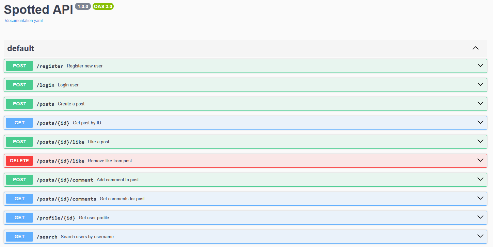
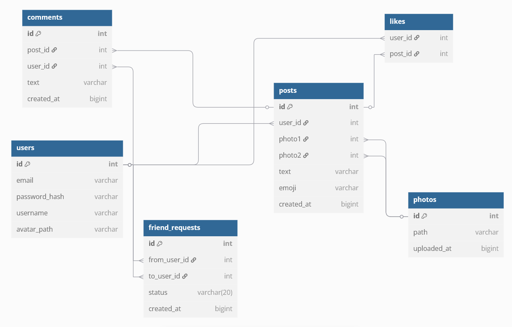

# 🏋️ Spotted — Social Fitness App Backend

---

## 🚀 Tech Stack

| Technology  | Purpose                  |
|-------------|---------------------------|
| Kotlin      | Backend language          |
| Ktor        | Web framework             |
| Exposed     | ORM for PostgreSQL        |
| PostgreSQL  | Database                  |
| JWT         | Authentication            |
| Bcrypt      | Password hashing          |
| Swagger UI  | API documentation         |

---

## 📦 Features

- 🔐 User registration & login
- 📸 Uploading posts (2 photos + emoji + optional description)
- 🔎 Search by username
- ❤️ Like/unlike posts
- 💬 Comment on posts
- 👤 User profile with post previews & friend count
- 🔐 Protected endpoints with JWT

---

## 📄 API Documentation

- 👉 [Open Swagger UI](https://super-duper-gym.github.io/API/)
- All endpoints, parameters, and response formats are documented



---

## 🗃️ Database Schema

👉 [View on dbdiagram.io](https://dbdiagram.io/d/Spotted-Database-Schema-680bbdbd1ca52373f563b588)


---

## 🌱 Environment Variables

To run the project set up .env file with the following variables:
```env
DB_URL=localhost:5432
DB_USER=your_username
DB_PASSWORD=your_password
JWT_SECRET=your_jwt_secret
```

---

## 📌 TODO

- [ ] Feed (friends' posts)
- [ ] Friend requests and friendship system
- [ ] Smart username search
